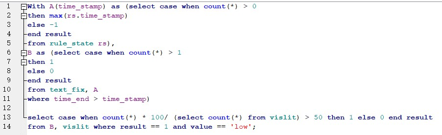

**folder and file:**

./application/backend/classifiers :  the folder to store trained classifiers

./classification_dataset: training data and result for replicated and further tuned classification experiment.

./classification_experiment.py  the file of classification experiment code.

**database:**

./database/user_model_state_ref_highlight_ml.db (contains vislit user state event)

**params:**

USE_FIXATION_ALGORITHM = True

USE_EMDAT = True

USE_ML = True

KEEP_TASK_FEATURES = True

KEEP_GLOBAL_FEATURES = True

USER_MODEL_STATE_PATH = "./database/user_model_state_ref_highlight_ml.db"

**Run:**

Simply as usual pilot testing: python experimenter_platform_study_bars_final.py    or python experimenter_platform_new_intervention_pilot.py

You should find prediction result made at each call back time run is printed in running log.  Unfortunately, the gaze_event_rule database I made before is lost, but it doesn't affect the real-time prediction part. (My laptop battery exploded last week and that file I didn't save at disk.)

To make intervention personalized according to vislit prediction results, simply change each delivery_sql_condition like below:

**Add another predictor:**

I've changed the field self.threshold to dictonary. e.g. {'vislit': 0.5, 'read_prof' : 0.7}, so that regression preditors are supported as well. 

1. Train a predictor and save **the model** and **feature names used** in folder **classifiers**(use joblib). Naming format: classifier_xxx.joblib; feature_names_xxx.joblib.

2. You may want add additional logic in method: notify_app_state_controller to handle multi-class classification if you would like to do in the future.